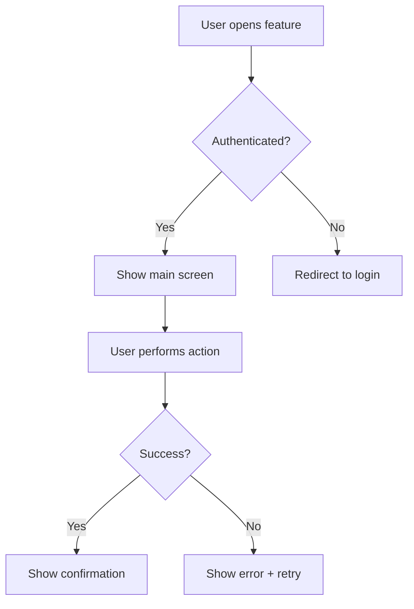
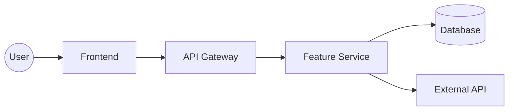
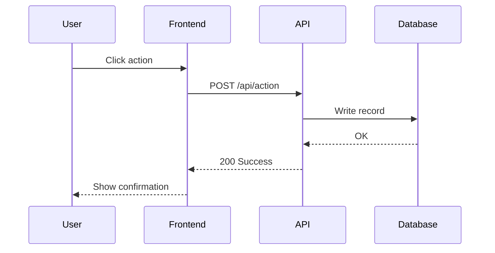

# Workflow: compass:prd

You are the product writer. Mission: produce a complete, actionable PRD that the dev team can estimate and build from.

**Principles:** PRD contains NO code — ever. Every section must be filled, not left as TBD. Goals must be measurable. User flows must be concrete, step-by-step. Derive questions from context, not templates. ≥3 options for every design decision — show trade-offs, not yes/no.

**Purpose**: Write a complete PRD (Product Requirements Document) at enterprise Product Management standard. The spec document **contains no code** — it only describes the problem, users, requirements, scope, and success criteria.

**Output**:
- Silver Tiger mode: filename pattern read from `config.naming.prd` (fallback: `{PREFIX}-{YYYY-MM-DD}-{slug}.md`)
- Standalone mode: filename pattern read from `config.naming.prd_standalone` (fallback: `PRD-{slug}-v{version}.md`)

**When to use**:
- You have a clear idea and need a spec for the dev team to estimate
- You need to align stakeholders before a sprint
- You need to submit a PRD for leadership review

---

Apply the UX rules from `core/shared/ux-rules.md`.

---

## Step 0 — Resolve active project

Apply the shared snippet from `core/shared/resolve-project.md`. It sets up `$PROJECT_ROOT`, `$CONFIG`, and `$PROJECT_NAME` for downstream steps and prints the "Using: <name>" banner.

### Step 0 (continued) — Use CONFIG from resolve-project

The `resolve-project.md` Step 0 snippet has already populated `$CONFIG` with the parsed `config.json` contents. Reuse the variable — do NOT re-read disk.

If `$CONFIG` is somehow empty (edge fallback): read `$PROJECT_ROOT/.compass/.state/config.json` directly.

Parse `$CONFIG` once and extract all required fields below in a single pass. Do not re-parse for individual fields later in the workflow — reuse the parsed variables.

Required fields:
- `lang` — chat language (`en` or `vi`)
- `spec_lang` — language for the PRD file content (`same` | `en` | `vi` | `bilingual`). When `same`, resolve to `lang`.
- `mode` — `silver-tiger` or `standalone`
- `prefix` — project prefix (Silver Tiger only, e.g. `SV`, `KMS`, `TD`)
- `templates_path` — path to templates directory
- `output_paths` — where to write artifacts
- `naming` — filename patterns
- `capability_registry` — path to capability-registry.yaml (Silver Tiger only)

**Error handling**:
- If config file does not exist → tell the user to run `/compass:init` first and stop.
- If config file exists but is corrupt or invalid JSON (parse error) → show a clear error: "Config file appears to be corrupt or invalid. Please run `/compass:init` to recreate it." and stop.
- If config file is valid JSON but missing required fields → list the missing fields and tell the user to run `/compass:init` to fix the config.

**Naming config**: Read `config.naming` for filename patterns.
- Silver Tiger: use `config.naming.prd` if present; fallback to `{PREFIX}-{YYYY-MM-DD}-{slug}.md`
- Standalone: use `config.naming.prd_standalone` if present; fallback to `PRD-{slug}-v{version}.md`

**Language enforcement**: from this point on, ALL user-facing chat text MUST be in `lang`. The PRD file content is in `spec_lang`. They can differ (e.g. chat in Vietnamese, PRD in English for international stakeholders).

Extract `interaction_level` from config (default: "standard" if missing):
- `quick`: minimize questions — auto-fill defaults, skip confirmations, derive everything from context. Only ask when truly ambiguous.
- `standard`: current behavior — ask key questions, show options, confirm decisions.
- `detailed`: extra questions — deeper exploration, more options, explicit confirmation at every step.

---

### Auto mode (interaction_level = quick)

If interaction_level is "quick":
1. Skip Step 0b (project scan) — proceed directly
2. Skip Section A status question — default to "Draft"
3. For Sections B-F: derive ALL answers from $ARGUMENTS + available context (PRDs, research). Do NOT ask any AskUserQuestion calls. Fill every section using inference.
4. Show the complete PRD at the end for one final review: "OK? / Edit"
5. Total questions: 0-1 (only the final review)

If interaction_level is "detailed":
1. Run Step 0b as normal
2. Ask all Section A, B, C, D, E, F questions
3. After each section, add a review question: "Section X OK? / Edit"
4. Total questions: ~15-20

If interaction_level is "standard":
1. Current behavior — no changes needed

---

## Step 0a: Pipeline + Project choice gate

PRD is an artifact-producing workflow — apply Step 0d from `core/shared/resolve-project.md` here. The shared gate handles:
- Scanning all active pipelines in the current project and scoring relevance to `$ARGUMENTS`
- Asking a single case-appropriate question (continue pipeline / standalone / other project / cleanup hint)
- Exporting `$PIPELINE_MODE`, `$PIPELINE_SLUG`, and (if the PO switched) a refreshed `$PROJECT_ROOT`

**After Step 0d returns:**

- If `$PIPELINE_MODE=true`, remember `$PIPELINE_SLUG`. When Step 7 writes the PRD file, also copy it to `$PROJECT_ROOT/.compass/.state/sessions/$PIPELINE_SLUG/prd-<topic>.md` and append to `pipeline.json`:
  ```json
  { "type": "prd", "path": "<output-file-path>", "session_path": "$PROJECT_ROOT/.compass/.state/sessions/$PIPELINE_SLUG/prd-<topic>.md", "created_at": "<ISO>" }
  ```
- If `$PIPELINE_MODE=false`, proceed as standalone — Step 7 writes only to the `prd/` folder.
- If the PO switched project mid-gate, `$PROJECT_ROOT` is now different — re-read `$CONFIG` and `$SHARED_ROOT` from the new project before continuing to Step 0b.

---

## Step 0b: Project awareness check

Apply the shared project-scan module from `core/shared/project-scan.md`.
Pass: keywords=$ARGUMENTS, type="prd"

The module handles scanning, matching, and asking the user:
- If "Use as context" → read ALL found files; feed their content into the PRD writing process (reference research findings, existing stories, technical constraints when filling PRD sections)
- If "Update" → open existing PRD, ask what needs changing
- If "New version" → read existing as base, bump version
- If "Ignore" → continue fresh
- If "Show me" → display files, re-ask

---

## Step 0c: Build AUTOFILL hints (silent)

Before entering the interview (Step 4), derive as many answers as possible from context the user has ALREADY given. Every hint here becomes `options[0]` in the corresponding batched AskUserQuestion call — labeled `Auto-detected: <value>` — so the user accepts with one click instead of typing.

This step does NOT ask the user anything. It only builds an `AUTOFILL` hint map used by Section A–F.

**Sources to mine (in order)**:

1. **$ARGUMENTS** — the free-text args passed to `/compass:prd`:
   - If the arg looks like a feature name (2–6 words, imperative verb or noun phrase) → set `AUTOFILL.A1 = <arg as title-case>`.
   - If the arg contains a URL or file path, leave it for source detection in Step 3.

2. **CONFIG (from Step 0)** — the parsed `config.json`:
   - `AUTOFILL.stakeholders = config.team.stakeholders` (used in Section G / Open Questions)
   - `AUTOFILL.po = config.team.po`
   - `AUTOFILL.prefix = config.prefix` (Silver Tiger only)
   - `AUTOFILL.A3 = "Draft"` (sensible default for PRD status)

3. **Active pipeline context** (from Step 0a) — if `pipeline_mode = true`:
   - Read `$PROJECT_ROOT/.compass/.state/sessions/<slug>/context.json` → extract `title`, `problem`, `users`.
   - `AUTOFILL.A1 = context.title` (if A1 wasn't set from $ARGUMENTS)
   - `AUTOFILL.B1 = context.problem` (pipeline brief already captured the problem)
   - `AUTOFILL.C1 = context.primary_user` if present

4. **Project-scan hits (from Step 0b)** — if matched PRDs exist in same epic:
   - Read their frontmatter / Section C (Users).
   - `AUTOFILL.C1_candidates = [list of personas from sibling PRDs]` — use as derived options in Section C batched call.
   - `AUTOFILL.D2_candidates = platform/scope non-goals that recur across sibling PRDs` — use as derived options in Section D.

5. **IDEA / brief file (if referenced in $ARGUMENTS or Step 3)**:
   - After Step 3 source is answered, if user points to an IDEA/brief file, read it and extract problem/users/goals to pre-fill Sections B, C, D as `Auto-detected: <summary>` options.

**How AUTOFILL is consumed**:

When generating batched AskUserQuestion calls for Sections A–F:
- If `AUTOFILL.<key>` exists for a question, place it as `options[0]` with the label pattern `Auto-detected: <value>` and description `Accept detected — click to confirm`.
- Keep the other derived options so the user can override.
- Always keep the free-text `Other — I'll describe` option as the last item.

**Do not hallucinate AUTOFILL values**. If a source does not clearly provide the answer, leave AUTOFILL empty for that key and ask the question normally.

---

## Step 1 — Hard rule (PRD = no code)

**PRDs MUST NOT CONTAIN CODE.**

- No code snippets (no ` ```js `, ` ```python `, ` ```sql `, no pseudocode)
- No SQL/Prisma/Pydantic schemas
- No API endpoint signatures like `POST /api/users`
- No file paths / class names / function names from the implementation

A PRD describes **WHAT** and **WHY**, not **HOW**. Implementation details belong in the DESIGN-SPEC written by engineering later.

If you find yourself about to paste code, stop and rewrite in plain language. Example:
- Bad: `POST /api/upload with multipart/form-data`
- Good: "The system lets users upload files via the web UI; the backend accepts and processes the multipart upload."

## Step 2 — Read context

1. Load team, PO, stakeholders from `$CONFIG` (already parsed in Step 0).
2. **Resolve template** — apply `core/shared/template-resolver.md` with `TEMPLATE_NAME="prd-template"`. This checks `$SHARED_ROOT/templates/prd-template.md` first (Silver Tiger authoritative), falls back to `~/.compass/core/templates/prd-template.md` (bundled). Store the resolved path as `$TEMPLATE_PATH` and source as `$TEMPLATE_SOURCE`.
3. Read `$TEMPLATE_PATH` — this is the PRD skeleton to fill.
4. If `$SHARED_ROOT` exists: read `$SHARED_ROOT/capability-registry.yaml` — used in Step 5 for dependency discovery.
5. Read `$PROJECT_ROOT/wiki/overview.md` if it exists — for product context.
6. List existing PRDs in `$PROJECT_ROOT/prd/` to check name collisions.
7. List relevant IDEA files in `$PROJECT_ROOT/research/` (if the user is referring to one).

## Step 3 — Identify source, read it, then propose type (3 sub-steps)

Asking PRD type BEFORE reading the source is an anti-pattern — a PO updating a login flow could legitimately be either an `enhancement` (inherit users + old flow) or a `new-feature` (redesign changes both). Picking blindly leads to Step 4 asking the wrong sections. Read the source first, THEN propose type with evidence.

### 3a. Ask source only

```json
{"questions": [{"question": "What is this PRD based on?", "header": "PRD Source", "multiSelect": false, "options": [
  {"label": "An existing IDEA file", "description": "I'll use it as the starting point — share the path"},
  {"label": "A new idea (not through /compass:ideate)", "description": "Build from scratch"},
  {"label": "Update / new version of an existing PRD", "description": "I'll read the old PRD and ask what's changing"},
  {"label": "A brief from leadership / stakeholder", "description": "Share the brief and I'll structure it"}
]}]}
```

vi: regenerate with Vietnamese labels/descriptions.

### 3b. Read the source (silent, unless "new idea")

- Source = IDEA file → read the idea file, extract: problem, chosen direction, key constraints
- Source = Update of existing PRD → ask for path, read prior PRD; extract: prior Users (Section C), prior Flow (Section F), prior Metrics, prior Out of Scope. **Store as `PRIOR_PRD_SECTIONS`** — these are the inherit-candidates.
- Source = Brief from leadership → ask for brief content or path, read it
- Source = New idea → no source to read, set `PRIOR_PRD_SECTIONS = null`

### 3c. Propose PRD type + scope (context-aware)

Analyze `$ARGUMENTS` + source content to judge:

**type** — `new-feature` vs `enhancement`:
- Source = "Update of existing PRD" → default `enhancement`
- Source = IDEA + idea describes "net new capability" → `new-feature`
- Source = IDEA + idea describes "improve / fix existing X" → `enhancement`
- Source = Brief with "build X" verb → `new-feature`
- Source = Brief with "change/improve X" verb → `enhancement`

**enhancement_targets** — which existing sections does this enhancement ACTUALLY change? This is the key nuance: `enhancement` doesn't mean "skip Users and Flow always" — it means "inherit what's not touched, redefine what is."

Detect target sections from `$ARGUMENTS` keywords:

| Keywords in input | Target section | Why |
|---|---|---|
| "flow", "journey", "path", "steps", "UX", "onboarding", "funnel", "signup", "checkout" | **F (Flow)** | User is changing the flow explicitly |
| "persona", "user type", "role", "audience", "segment", "admin", "member" | **C (Users)** | User/persona scope expanding |
| "metric", "KPI", "target", "goal", "measurement", "activation rate", "churn" | **E (Metrics)** | Metric definition changing |
| "goal", "non-goal", "scope in", "scope out", "out of scope" | **D (Goals)** | Goal set changing |
| "bug", "error", "issue", "pain" + no section keyword | **B (Problem)** | Only problem framing changes, inherit everything else |
| Multiple of above | multi-target | Render each touched section |

Construct the type + targets proposal and confirm via AskUserQuestion:

```json
{"questions": [{"question": "Based on <source>, this looks like <type>. <If enhancement: target sections: <C/F/E/D>>. Confirm?", "header": "PRD type", "multiSelect": false, "options": [
  {"label": "Confirm — <type> with targets [<sections>]", "description": "Proceed with Step 4 asking only these sections"},
  {"label": "Actually new-feature", "description": "Full PRD — ask all 6 sections A-F"},
  {"label": "Actually enhancement of different sections", "description": "I'll pick targets manually — show full target picker"},
  {"label": "Let me explain the change", "description": "Free-text explanation — AI re-judges"}
]}]}
```

**Handle confirmation**:
- Confirm → store `PRD_TYPE = <proposed>` and `PRD_TARGETS = [proposed targets]`
- "Actually new-feature" → `PRD_TYPE = new-feature`, `PRD_TARGETS = [A, B, C, D, E, F]`
- "Actually enhancement of different sections" → show multi-select picker with all 6 sections (A-F), PO picks targets
- "Let me explain" → free-text → AI re-analyzes → re-propose

### 3d. Resolve which sections to render in Step 4

Based on `PRD_TYPE` + `PRD_TARGETS`:

| Type | Sections always rendered | Sections conditionally rendered |
|---|---|---|
| `new-feature` | A, B, D, E | C, F (always included) |
| `enhancement` | A, B | C if target includes Users; D if target includes Goals; E if target includes Metrics; F if target includes Flow |

Always include AC (Acceptance Criteria) regardless.

Inherit the non-rendered sections from `PRIOR_PRD_SECTIONS` at compose time (Step 6).

**Examples**:

- Input: `"enhance the signup flow"` → `type=enhancement`, `targets=[F]` → Step 4 renders A + B + F + AC. Inherit C, D, E.
- Input: `"add 2FA to login"` (brand new capability) → `type=new-feature`, `targets=[all]` → Step 4 renders A-F + AC.
- Input: `"expand admin permissions for team roles"` → `type=enhancement`, `targets=[C]` → Step 4 renders A + B + C + AC. Inherit D, E, F.
- Input: `"change primary metric from DAU to WAU"` → `type=enhancement`, `targets=[E]` → Step 4 renders A + B + E + AC. Inherit C, D, F.
- Input: `"redesign signup flow for enterprise users"` → `type=enhancement`, `targets=[C, F]` → Step 4 renders A + B + C + F + AC. Inherit D, E.

## Step 4 — Interview to fill the PRD

**Emit progress plan before starting** — apply Pattern 1 from `core/shared/progress.md`. Dynamically list sections based on `PRD_TARGETS` from Step 3d:

```
📋 PRD: <feature name>
   Type: <PRD_TYPE>   Targets: [<PRD_TARGETS>]   Sections: <N>
   Expected: 2-5 min (scales with section count)

   ⏸  Section A — Identity        (always)
   ⏸  Section B — Problem         (always)
   ⏸  Section C — Users           (<render if in PRD_TARGETS else "inherit from prior">)
   ⏸  Section D — Goals           (<render if in PRD_TARGETS else "inherit from prior">)
   ⏸  Section E — Metrics         (<render if in PRD_TARGETS else "inherit from prior">)
   ⏸  Section F — Flow            (<render if in PRD_TARGETS else "inherit from prior">)
```

After each section's batched AskUserQuestion answer is received, tick that line with elapsed seconds and mark the next as `🔄`. For "inherit" sections, print `✓ Section X — inherited from <source>` and skip the interview.

> **Batching rule**: walk section by section. Within each section, batch all questions into a SINGLE `AskUserQuestion` call using the `questions` array (1–4 items per call). Claude Code's tool supports this natively — do NOT make separate sequential calls for questions in the same section.
>
> **Section rendering from `PRD_TARGETS`** (set in Step 3d):
> - Sections A, B → always rendered
> - Sections C, D, E, F → rendered only if in PRD_TARGETS; otherwise inherited from `PRIOR_PRD_SECTIONS` at compose time (Step 6)
> - `new-feature` has `PRD_TARGETS = [A, B, C, D, E, F]` → all sections rendered
> - `enhancement` has `PRD_TARGETS = [A, B, <subset>]` → only rendered subset is interviewed
>
> Smart-depth sections (E, F) may batch 2–4 questions depending on complexity.

**MINIMAL PRD mode** (adaptive depth for simple tasks):

Trigger when ALL of the following hold (judged at Step 4 entry, before rendering any section):
- `source == "A new idea"` (Step 3a answer) — not an update, not from IDEA file, not a brief
- `$ARGUMENTS` is narrow — word count < 15
- User didn't explicitly expand scope in Step 3c (picked Confirm rather than "Actually new-feature" override)

In MINIMAL mode, override `PRD_TARGETS` to `[A, B]` (force narrow scope regardless of proposal):
- Merge A + B into a single 2-question batch (feature name + problem statement)
- Skip Sections C/D/E/F interview entirely
- Step 6 composes a 1-page PRD format (Overview only + AC)
- Use for quick-spec features where a full PRD is overkill — e.g. "add logout button", "fix tooltip wording"

Print `✓ MINIMAL PRD mode — 1-page format (task is narrow; full PRD would be overkill)` at start.

PO can opt out by picking "Actually new-feature" at Step 3c, which forces `PRD_TARGETS = [A, B, C, D, E, F]` and disables MINIMAL.

### Section A: Identity (1 turn, 1 batched call)

**Batch all three identity fields (A1 feature name, A2 sprint/quarter, A3 status) into a SINGLE AskUserQuestion call with a `questions` array of 3 items.** Claude Code supports up to 4 questions per call — use it to collapse 3 sequential round trips into 1.

**Context awareness**: before asking, scan:
- `$ARGUMENTS` — if a feature name is obvious, put it as `options[0]` of A1 with label `Auto-detected: <name>` (user accepts with 1 click)
- Existing PRDs in project — if names follow a pattern, offer the pattern variant as an option

Generate all labels and descriptions in `lang` (do not translate hardcoded strings — regenerate in Vietnamese when `lang=vi`).

Batched structure (English example):

```json
{"questions": [
  {"question": "What is the feature or initiative name?", "header": "Feature Name", "multiSelect": false, "options": [{"label": "<auto-detected from $ARGUMENTS>", "description": "Accept detected name"}, {"label": "Bulk file upload", "description": "Example — adapt to your feature"}, {"label": "Type your own name", "description": "Enter a short, action-oriented title"}]},
  {"question": "Which sprint or quarter is this PRD targeting?", "header": "Sprint / Quarter", "multiSelect": false, "options": [{"label": "Current sprint", "description": "Ongoing sprint"}, {"label": "Next sprint", "description": "Upcoming sprint"}, {"label": "This quarter", "description": "Current quarter"}, {"label": "Next quarter", "description": "Planning ahead"}]},
  {"question": "What is the current status of this PRD?", "header": "PRD Status", "multiSelect": false, "options": [{"label": "Draft", "description": "Still being written"}, {"label": "Review", "description": "Ready for stakeholder feedback"}, {"label": "Approved", "description": "Signed off for sprint planning"}]}
]}
```

When `lang=vi`, generate the same structure with Vietnamese labels/descriptions. Do NOT make two separate calls for English and Vietnamese — pick one based on `lang`.

### Section B: Problem (1 turn, 1 batched call)

**Batch B1 (problem), B2 (evidence), B3 (consequence) into a SINGLE AskUserQuestion call with 3 questions.**

Before building options, gather context from:
- Section A answer (feature name)
- $ARGUMENTS and any source file (IDEA, brief, old PRD) read in Step 2–3
- Project-scan hits (related PRDs in same epic)

**Option generation rules**:
- **B1 options**: derive 2–3 problem statements that fit the feature context. For "file upload", suggest upload friction / size limits / manual workarounds — not generic placeholders.
- **B2 options**: derive evidence types available. If Jira linked → "linked Jira tickets". If competitive → "competitor gap". Always include free-text "Other".
- **B3 options**: derive consequences from B1's likely answer. User-friction problem → churn/workaround growth. Revenue problem → missed conversion.

**Smart depth**: simple feature = B1 + B3 only (skip B2). Complex = all three.

Batched structure (English):

```json
{"questions": [
  {"question": "What problem are users / the business facing?", "header": "Problem", "multiSelect": false, "options": [{"label": "<derived option 1>", "description": "..."}, {"label": "<derived option 2>", "description": "..."}, {"label": "Other — I'll describe", "description": "Type your own problem statement"}]},
  {"question": "What evidence supports this?", "header": "Evidence", "multiSelect": false, "options": [{"label": "<derived option 1>", "description": "..."}, {"label": "<derived option 2>", "description": "..."}, {"label": "No formal evidence yet", "description": "Mostly stakeholder intuition"}, {"label": "Other — I'll describe", "description": "Type the evidence you have"}]},
  {"question": "What happens if we do nothing?", "header": "Cost of Inaction", "multiSelect": false, "options": [{"label": "<derived option 1>", "description": "..."}, {"label": "<derived option 2>", "description": "..."}, {"label": "Other — I'll describe", "description": "Type the impact you expect"}]}
]}
```

Areas to cover across the 3 questions: user friction, business impact, evidence signals, cost of inaction, time sensitivity.

When `lang=vi`, regenerate all labels/descriptions in Vietnamese.

### Section C: Users (1 turn, 1 batched call — conditional on PRD_TARGETS)

**Skip this entire section if `C` is NOT in `PRD_TARGETS`** (from Step 3d) — inherit primary/secondary users from `PRIOR_PRD_SECTIONS.users` (the linked source PRD or IDEA file). Print `✓ Section C — inherited from <source>` and move to next section.

Render this section when:
- `PRD_TYPE = new-feature` (always rendered)
- `PRD_TYPE = enhancement` AND the enhancement targets Users (e.g. "expand admin roles", "add guest persona")

**Batch C1 (primary user), C2 (secondary users), C3 (out-of-scope users) into a SINGLE AskUserQuestion call with 3 questions.**

**Context to draw from**: feature name (A1), problem statement (B1 likely answer), product tier / platform constraints, any PRD in the same epic (inherit persona vocabulary).

**Option generation rules**:
- **C1**: infer 2–3 persona suggestions from problem context. "Admin user management" → Admin leads. "File sharing with guests" → Guest leads. Always include "Other — I'll describe".
- **C2**: base candidates on C1's most likely answer. Primary Admin → Team Members / Approvers. Primary End User → Admins monitoring. Always include "None — single-persona feature".
- **C3**: derive exclusion candidates from product tier (paid-plan only, web-only, org-size gated). If no obvious exclusions → lead option "All users in scope".

Batched structure (English):

```json
{"questions": [
  {"question": "Who is the primary user of this feature?", "header": "Primary User", "multiSelect": false, "options": [{"label": "<persona 1 derived>", "description": "..."}, {"label": "<persona 2 derived>", "description": "..."}, {"label": "Other — I'll describe", "description": "Type the primary persona"}]},
  {"question": "Secondary users (if any)?", "header": "Secondary User", "multiSelect": false, "options": [{"label": "None — single-persona feature", "description": "Only primary persona uses this"}, {"label": "<derived secondary 1>", "description": "..."}, {"label": "<derived secondary 2>", "description": "..."}, {"label": "Other — I'll describe", "description": "Type the secondary persona"}]},
  {"question": "Who will NOT use this feature (out of scope)?", "header": "Exclusions", "multiSelect": false, "options": [{"label": "All users are in scope", "description": "No explicit exclusions"}, {"label": "<exclusion 1 derived>", "description": "..."}, {"label": "<exclusion 2 derived>", "description": "..."}, {"label": "Other — I'll describe", "description": "Type the exclusion"}]}
]}
```

When `lang=vi`, regenerate all labels/descriptions in Vietnamese.

### Section D: Goals and Non-goals (1 turn, 1 batched call — conditional on PRD_TARGETS)

**Skip this section if `D` is NOT in `PRD_TARGETS`** (enhancement not targeting goals) — inherit goals/non-goals from `PRIOR_PRD_SECTIONS.goals`. Print `✓ Section D — inherited from <source>`.

Render when: `PRD_TYPE = new-feature` OR `PRD_TYPE = enhancement` with `D` in targets (e.g. "change success goal", "add non-goal to scope").

**Batch D1 (goals) and D2 (non-goals) into a SINGLE AskUserQuestion call with 2 questions, both `multiSelect: true`.**

**Context to draw from**: B1 (problem), B2 (evidence — may hint at support volume, revenue), C1 (primary user), epic metadata (if in Silver Tiger mode).

**Option generation rules**:
- **D1 goals**: derive 3–4 concrete, measurable goals from problem + user context. "Bulk file upload" with workaround problem → "Reduce time to upload multiple files by 50%", "Eliminate manual one-by-one upload workaround" — not generic placeholders.
- **D2 non-goals**: derive 3–4 specific non-goals from what the feature does NOT touch. Feature focused on web UI → "No mobile app changes this round". Feature is admin-only → "End user UI changes out of scope".
- Both questions always include "Other — I'll describe" as last option.

Batched structure (English):

```json
{"questions": [
  {"question": "Goals — pick 2–4 measurable goals for this feature", "header": "Goals", "multiSelect": true, "options": [{"label": "<goal 1 derived>", "description": "..."}, {"label": "<goal 2 derived>", "description": "..."}, {"label": "<goal 3 derived>", "description": "..."}, {"label": "Other — I'll describe", "description": "Type additional goals"}]},
  {"question": "Non-goals — pick 2–4 things explicitly NOT in scope", "header": "Non-goals", "multiSelect": true, "options": [{"label": "<non-goal 1 derived>", "description": "..."}, {"label": "<non-goal 2 derived>", "description": "..."}, {"label": "<non-goal 3 derived>", "description": "..."}, {"label": "Other — I'll describe", "description": "Type additional non-goals"}]}
]}
```

When `lang=vi`, regenerate all labels/descriptions in Vietnamese.

**Validation after user answers**: check that no item appears in both D1 and D2 — if overlap, ask user to clarify.

### Section E: Success metrics (1 turn, 1 batched call — smart depth, conditional on PRD_TARGETS)

**Skip this section if `E` is NOT in `PRD_TARGETS`** — inherit metrics from `PRIOR_PRD_SECTIONS.metrics`. Print `✓ Section E — inherited from <source>`.

Render when: `PRD_TYPE = new-feature` OR `PRD_TYPE = enhancement` with `E` in targets (e.g. "change primary metric from DAU to WAU", "add guardrail metric").

**Batch E questions into a SINGLE AskUserQuestion call.** Tool supports max 4 questions per call.

**Depth decision — make this BEFORE calling the tool**:
- Straightforward feature (clear scope, low risk) → batch **2 questions** [E1 primary metric + E4 guardrail]
- Complex / business-critical feature (new surface, revenue impact, cross-team) → batch **4 questions** [E1 + E2 baseline + E3 ramp target + E4 guardrail]

**Option generation rules** (draw from D1 goals + B1 problem):
- **E1 primary metric**: must connect directly to D1. Goal "reduce upload time" → suggest "avg upload task duration" or "% users completing without manual workaround" (not generic adoption rate).
- **E2 baseline** (if asked): net-new feature → baseline 0. Improvement → prior metric value. B2 evidence may have supplied specific numbers.
- **E3 target** (if asked): adoption goals → percentage ramps over 30/60/90 days. Efficiency goals → improvement percentages. Net-new → "establish baseline first".
- **E4 guardrail**: feature touches file handling → latency/throughput. Auth → error rate/lockouts. UI flow → core-feature retention.

Batched structure — simple case (English, 2 questions):

```json
{"questions": [
  {"question": "Primary metric to judge success?", "header": "Primary Metric", "multiSelect": false, "options": [{"label": "<E1 option 1>", "description": "..."}, {"label": "<E1 option 2>", "description": "..."}, {"label": "Other — I'll describe", "description": "Type your metric"}]},
  {"question": "Guardrail metric (must NOT regress)?", "header": "Guardrail", "multiSelect": false, "options": [{"label": "<E4 option 1>", "description": "..."}, {"label": "<E4 option 2>", "description": "..."}, {"label": "Other — I'll describe", "description": "Type the guardrail"}]}
]}
```

Complex case (4 questions): same structure with E2 baseline + E3 target added between E1 and E4.

When `lang=vi`, regenerate all labels/descriptions in Vietnamese.

### Section F: User flow and requirements (1 turn, 1 batched call — smart depth, conditional on PRD_TARGETS)

**Skip this entire section if `F` is NOT in `PRD_TARGETS`** (from Step 3d) — inherit happy path and edge cases from `PRIOR_PRD_SECTIONS.flow`. Print `✓ Section F — inherited from <source>` and move to next section.

Render when:
- `PRD_TYPE = new-feature` (always rendered)
- `PRD_TYPE = enhancement` AND the enhancement targets Flow (e.g. "redesign signup", "simplify checkout", "improve onboarding funnel")

**Batch F questions into a SINGLE AskUserQuestion call.**

**Depth decision — BEFORE calling the tool**:
- Simple single-screen feature → batch **2 questions** [F1 flow pattern + F2 edge cases]
- Multi-system feature or has external dependencies → batch **3 questions** [F1 + F2 + F3 dependencies]

**Option generation rules** (draw from feature name + C1 primary user + D1 goals):
- **F1 flow pattern**: infer likely pattern from feature type. "Bulk upload" → drag-drop multi-select. "Admin management" → list-view→invite/edit→confirm. "Key rotation" → async background-job with status tracking. Always include "Walk me through in your own words".
- **F2 edge cases**: derive from feature's technical surface. Upload → size limits / unsupported format / network timeout. Permission → role conflict / concurrent edit / session expiry. Async → job failure / retry / partial success.
- **F3 dependencies** (if asked): in Silver Tiger mode, cross-reference capability registry (from Step 5). Suggest likely capability deps. Always include "None — self-contained".

Batched structure — simple case (English, 2 questions):

```json
{"questions": [
  {"question": "Which flow pattern fits the happy path?", "header": "Flow Pattern", "multiSelect": false, "options": [{"label": "<F1 option 1 derived>", "description": "..."}, {"label": "<F1 option 2 derived>", "description": "..."}, {"label": "Walk me through in your own words", "description": "Describe the steps"}]},
  {"question": "Important edge cases / unhappy paths?", "header": "Edge Cases", "multiSelect": true, "options": [{"label": "<F2 option 1>", "description": "..."}, {"label": "<F2 option 2>", "description": "..."}, {"label": "<F2 option 3>", "description": "..."}, {"label": "Other — I'll describe", "description": "Type the edge case"}]}
]}
```

Complex case (3 questions): add F3 dependencies question after F2.

**After F1 is answered**: expand the chosen pattern into 5–8 numbered steps when composing the PRD (Step 6).

When `lang=vi`, regenerate all labels/descriptions in Vietnamese.

### Diagrams (Mermaid)

Every PRD MUST include at least 2 Mermaid diagrams. All diagrams must be DERIVED from the actual feature context gathered in Sections A–F — not copy-pasted from these examples. The examples below are illustrative only.

**1. User Flow Diagram** — the happy path from Section F, visualized:



Derive the nodes and edges from the UX flows described in Section F. Include:
- Happy path (main flow)
- Key decision points (conditionals)
- Error states (at least 1)
- The complete path from entry to completion

**2. System Context Diagram** — what components are involved:



Derive from the feature description. Show:
- User entry point
- Frontend/client
- Backend services involved
- Data stores
- External dependencies

**3. Sequence Diagram** (if the feature involves multiple services or async flows):



Include sequence diagram when:
- Feature involves API calls between frontend and backend
- There are async operations (webhooks, background jobs)
- Multiple services coordinate (microservices)

Skip sequence diagram for simple CRUD or static-page features.

All diagrams use Mermaid syntax (renders on GitHub, GitLab, Confluence, Notion).

### Section G: Open questions (model fills in + asks user)

While writing the sections above, you (the model) will notice things that aren't clear. List 3-8 of the most important open questions, each tagged with the stakeholder who should answer.

## Step 5 — Discover dependencies (Silver Tiger mode only)

This step is SKIPPED in standalone mode.

1. Read `{capability_registry}` (e.g. `../shared/capability-registry.yaml`).
2. Extract keywords from the PRD content gathered in Step 4 (feature name, user flow mentions, problem statement).
3. For each capability in the registry, check if the PRD keywords match any of its `keywords` list.
4. For each matched capability:
   - Record: name, product, domain, po, po_lead.
   - Mark as `direct` dependency.
5. Follow transitive dependencies ONE level deep:
   - For each directly matched capability, check its `consumers` list.
   - If the current product appears in `consumers`, mark the relationship.
   - Check the matched capability's own likely dependencies (e.g. if it uses `kms`, mark `kms` as `transitive via <capability>`).
6. Build the Dependencies table for the PRD:

```markdown
## Dependencies
| Capability | Type | Domain | PO | PO Lead |
|---|---|---|---|---|
| <capability-name> | direct | <domain> | @<po> | @<lead> |
| <other-capability> | transitive (via above) | <domain> | @<po> | @<lead> |
```

Replace all `<placeholders>` with ACTUAL values from the capability registry. These are examples only.

If NO dependencies found, write: "No cross-product dependencies detected. If this seems wrong, review the capability registry manually."

## Step 6 — Compose the PRD

Domain context is already in the project's `CLAUDE.md` header (written by `/compass:init`), which Claude Code auto-loads on every turn. No separate compose step or CLI call is needed — the writer colleague already has the domain rules in context.

Use `$TEMPLATE_PATH` (resolved in Step 2 via `core/shared/template-resolver.md`). Fill every section with data from Step 4 and Step 5. If `$SHARED_ROOT` is empty (no capability registry), skip the Dependencies table.

**Section inclusion by PRD_TYPE**:
- `new-feature` → include all sections (A, B, C, D, E, F, Dependencies if Silver Tiger, Open Questions).
- `enhancement` → include A, B, D, E, Dependencies (if Silver Tiger), Open Questions. For Users and User Flow, insert a "See source PRD: <path>" reference line instead of full sections. If source content is substantive, you may inline a 1–2 line summary.

> For mid-tier models: write one section at a time and ask the user "is this section OK?" before moving on.
> For frontier models: you may write a full draft in one turn and self-review.

After writing, **re-read the entire PRD** and check:
- No code snippets anywhere
- Every section has content (no empty TBD — if data is missing, write "TBD — needs <stakeholder>")
- Goals and Non-goals are symmetric — nothing appears in both lists
- Success metrics are measurable, with baseline and target
- The user flow is readable on paper (after reading the happy path, you understand what the feature does)
- If `config.domain` is set, the PRD reflects the domain conventions already described in `CLAUDE.md` and in `<shared_path>/domain-rules/<domain>.md` (per Silver Tiger). Spot-check: section names and writer constraints typical for that domain are visible in the draft.

## Step 7 — Write the file

**Silver Tiger mode:**
- Read `config.naming.prd` for the filename pattern. If missing, use fallback: `{PREFIX}-{YYYY-MM-DD}-{slug}.md`
- Slug = kebab-case feature name (e.g. `bulk-file-upload`)
- Date = today in YYYY-MM-DD format
- Path: `{output_paths.prd}/{filename}`
- Example (fallback pattern): `prd/SV-2026-04-11-bulk-file-upload.md`

**Standalone mode:**
- Read `config.naming.prd_standalone` for the filename pattern. If missing, use fallback: `PRD-{slug}-v{version}.md`
- Slug = kebab-case feature name
- Version: starts at `v1.0`. If updating an existing PRD, bump: `v1.1`, `v2.0`, etc.
- Path: `{output_paths.prd}/{filename}`
- Example (fallback pattern): `.compass/PRDs/PRD-bulk-file-upload-v1.0.md`

Create the output directory if it doesn't exist (`mkdir -p`).

If `spec_lang` is `bilingual`, also generate the translated version. Apply the same naming pattern with a language suffix (`-vi` or `-en`) appended before `.md`.

**Filename collision**: if a file with the same name exists, use AskUserQuestion:

```json
{"questions": [{"question": "A file with this name already exists. What should I do?", "header": "Filename Conflict", "multiSelect": false, "options": [{"label": "Overwrite", "description": "Replace the existing file."}, {"label": "Create with suffix", "description": "Save as a new file with a version suffix (e.g. -v2)."}]}]}
```

Vietnamese example (used when `lang=vi`):
```json
{"questions": [{"question": "Đã tồn tại file với tên này. Bạn muốn làm gì?", "header": "Xung đột tên file", "multiSelect": false, "options": [{"label": "Ghi đè", "description": "Thay thế file hiện có."}, {"label": "Tạo file mới với hậu tố", "description": "Lưu dưới tên mới với hậu tố phiên bản (ví dụ: -v2)."}]}]}
```

**After writing the file, update the project index:**
```bash
compass-cli index add "<output-file-path>" "prd" 2>/dev/null || true
```
This keeps the index fresh for the next workflow — instant, no full rebuild needed.

## Step 8 — Confirm and suggest next

Emit the final progress summary (Pattern 1 Step C from `core/shared/progress.md`):

```
✅ Done: <output-file-path>
   Type: <PRD_TYPE>   Sections: <N>   Total: <elapsed>
```

Then show (in `lang`):

```
Sections:
  <checkmark> Identity         <checkmark> Problem
  <checkmark> Users            <checkmark> Goals & Non-goals
  <checkmark> Success metrics  <checkmark> User flow
  <checkmark> Dependencies     <checkmark> Open questions (<N> items)

Open questions needing stakeholder answers:
  1. <Q1> -> ask <stakeholder>
  2. <Q2> -> ask <stakeholder>
  ...

Next:
  /compass:story <feature>      — break the PRD into User Stories
  /compass:prioritize           — compare with other initiatives
  Review with stakeholders      — share the PRD link with the team
```

In Silver Tiger mode, also mention discovered dependencies:
```
Dependencies found: <N>
  - <Capability> (<domain>) — PO: <@po>
  ...
Consider syncing with these POs before sprint planning.
```

## Save session

`$PROJECT_ROOT/.compass/.state/sessions/<timestamp>-prd-<slug>/`:
- `transcript.md` — full Q&A
- `result.md` — copy of the generated PRD

## Edge cases

- **User pushes you to put code in the PRD**: politely refuse and explain "the PRD describes what/why; code belongs in the DESIGN-SPEC. I'll write it in plain language instead of a code snippet."
- **User says "skip section X"**: ask why. If valid, allow it but record clearly in the file: "Section X: SKIPPED — reason: ..."
- **PRD is too short (<300 words)**: warn "this PRD is on the thin side — want me to dig deeper into any section?"
- **Capability registry not found** (`$SHARED_ROOT` empty or file missing): warn and skip dependency discovery. Note in the PRD: "Dependencies: registry not found — manual review needed."
- **Template not found** (`$TEMPLATE_SOURCE=none`): warn and generate PRD free-form. Note at top: "⚠ No template found — structure may differ from standard."
- **Output directory doesn't exist**: create it with `mkdir -p`.
- **Filename collision**: use AskUserQuestion as shown in Step 7.

---

## Final — Hand-off

Print one of these closing messages (pick based on `$LANG`):

- en: `✓ PRD saved. Next: `/compass:story` to break into user stories, or `/compass:check` to validate cross-refs.`
- vi: `✓ PRD đã lưu. Tiếp: `/compass:story` để break thành user stories, hoặc `/compass:check` để validate cross-refs.`

Then stop. Do NOT auto-invoke the next workflow.
