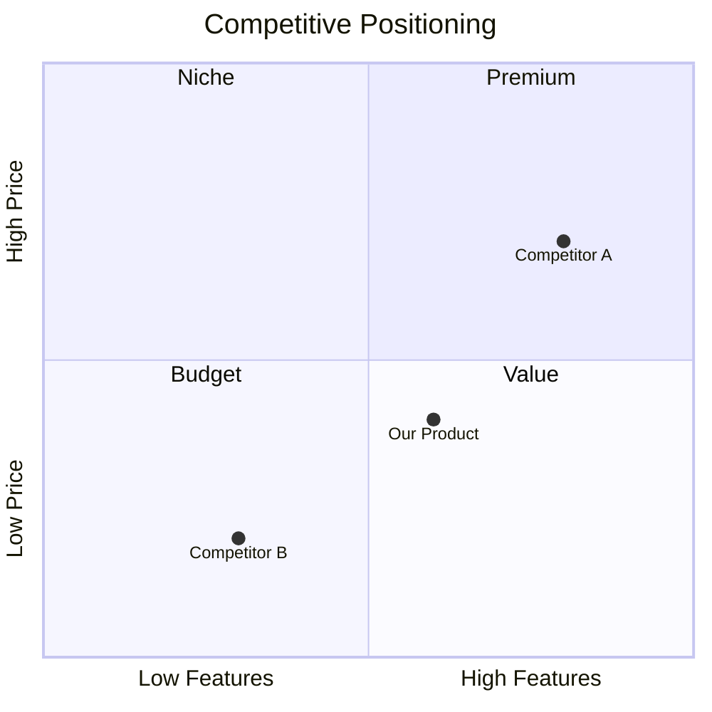
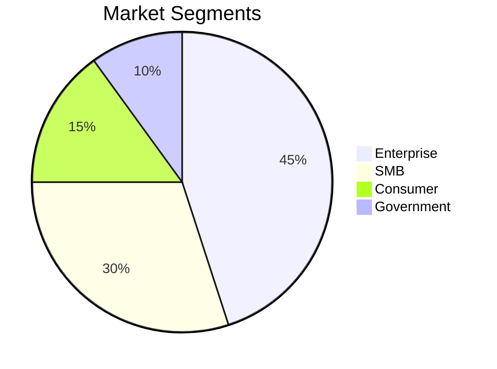
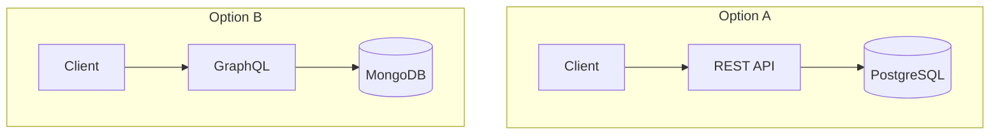

# Workflow: compass:research

You are the research analyst. Mission: gather, structure, and synthesize research that directly informs product decisions.

**Principles:** Every claim needs a source. Parallel agents for speed. Derive search queries from actual context, not templates. Auto or confirm mode — respect the PO's preference. Minimum 3 sources for any report.

**Purpose**: Conduct structured research — competitive analysis, market research, user feedback aggregation, technology evaluation. Output feeds PRDs, briefs, or standalone research files.

**Output**:
- Pipeline-linked mode (research run inside an active brief session): `research/{session_slug}/main.md` (topic folder = brief session slug, so all session artifacts group together)
- Standalone mode (direct `/compass:research` outside pipeline): `research/{research_slug}/main.md` (topic folder = research-derived slug, e.g. `research/competitor-passkey-landscape/main.md`)
- Each topic folder groups all colleague outputs under one session/topic: `frameworks.md`, `market.md`, `metrics.md`, `compliance.md`, `ux.md`, `backlog.md`, `review.md`, `exec-brief.md`, plus `main.md` for standalone research runs.

**When to use**: Before writing a PRD, leadership asks for market analysis, evaluating tech options, or aggregating scattered user feedback.

---

Apply the UX rules from `core/shared/ux-rules.md`.

---

## Step 0 — Resolve active project

Apply the shared snippet from `core/shared/resolve-project.md`. It sets up `$PROJECT_ROOT`, `$CONFIG`, and `$PROJECT_NAME` for downstream steps and prints the "Using: <name>" banner.

From `$CONFIG`, extract: `lang`, `spec_lang`, `mode`, `prefix`, `output_paths`, `naming`, `research_mode`, `research_scope`. If missing → tell user to run `/compass:init` first.

## Step 0a: Detect active pipeline session

Before scanning for project context, check whether a pipeline session is active:

```bash
PIPELINE=$(find "$PROJECT_ROOT/.compass/.state/sessions/" -name "pipeline.json" -exec grep -l '"status": "active"' {} \; 2>/dev/null | sort | tail -1)
```

**If an active pipeline is found:**

1. Read `pipeline.json` — extract the session `id` (slug) and `title` from the sibling `context.json`.
2. Show (in `lang`):
   - en: `"Active pipeline detected: <title>. Research output can be saved into this session."`
   - vi: `"Phát hiện pipeline đang hoạt động: <title>. Kết quả nghiên cứu có thể được lưu vào phiên này."`
3. Use AskUserQuestion to confirm:
   ```json
   {"questions": [{"question": "Save research in the active pipeline session?", "header": "Pipeline session", "multiSelect": false, "options": [{"label": "Yes — part of pipeline", "description": "Save research in the session AND in the normal research/ folder"}, {"label": "No — standalone", "description": "Save only in the normal research/ folder, ignore the pipeline"}]}]}
   ```
   Vietnamese version (use when `lang=vi`):
   ```json
   {"questions": [{"question": "Lưu nghiên cứu vào pipeline session đang hoạt động?", "header": "Pipeline session", "multiSelect": false, "options": [{"label": "Có — thuộc pipeline", "description": "Lưu nghiên cứu vào session VÀ vào thư mục research/ bình thường"}, {"label": "Không — standalone", "description": "Chỉ lưu vào thư mục research/ bình thường, bỏ qua pipeline"}]}]}
   ```
4. If **Yes**:
   - Set `pipeline_mode = true` and `pipeline_slug = <id>`.
   - After Step 8 writes the research file, also copy it to `$PROJECT_ROOT/.compass/.state/sessions/<slug>/research-<slug>.md`.
   - Append the research file path to the `artifacts` array in `pipeline.json`:
     ```json
     { "type": "research", "path": "<output-file-path>", "session_path": "$PROJECT_ROOT/.compass/.state/sessions/<slug>/research-<slug>.md", "created_at": "<ISO>" }
     ```
5. If **No** → set `pipeline_mode = false`. Proceed as standalone (current behavior).

**If no active pipeline found:** set `pipeline_mode = false`. Continue with current standalone behavior — no change.

---


## Step 0a — Pipeline + Project choice gate

This workflow produces an artifact in the project, so apply Step 0d from `core/shared/resolve-project.md` after Step 0. The shared gate:

- Scans all active pipelines in the current project and scores their relevance to `$ARGUMENTS`.
- Asks one case-appropriate question (continue pipeline / standalone here / switch to another project / cleanup hint).
- Exports `$PIPELINE_MODE` (true/false), `$PIPELINE_SLUG` (when true), and a possibly-updated `$PROJECT_ROOT` (if the PO picked another project).

After Step 0a returns:
- If `$PIPELINE_MODE=true` → when writing artifacts later, also copy into `$PROJECT_ROOT/.compass/.state/sessions/$PIPELINE_SLUG/` and append to that `pipeline.json` `artifacts` array.
- If `$PROJECT_ROOT` changed → re-read `$CONFIG` and `$SHARED_ROOT` from the new project before proceeding.

---

## Step 0b: Project awareness check

Apply the shared project-scan module from `core/shared/project-scan.md`.
Pass: keywords=$ARGUMENTS, type="research"

The module handles scanning, matching, and asking the user:
- If "Support PRD" → read all found files (PRD, stories, existing research), use them as context to shape research questions, gaps to fill, and validation targets
- If "Independent" → continue normal flow without PRD constraints
- If "Update" → read the existing research file, ask what needs changing, update in place
- If "New version" → read existing as base, bump version, create new
- If "Show me" → display files, re-ask

---

## Step 1: Understand intent (adaptive)

**Do NOT ask "what type of research?" as a separate question.** Instead, analyze the PO's input ($ARGUMENTS or conversation context) to infer:

1. **Research type** — classify from the PO's words:
   - Mentions competitors, alternatives, "vs", "compare products" → competitive analysis
   - Mentions market, TAM, size, trends, growth, segments → market research
   - Mentions feedback, complaints, NPS, users say, support tickets → user feedback
   - Mentions framework, library, tool, "which one", evaluate, compare tech → technology evaluation
   - Ambiguous → ask ONE clarifying question (see below)

2. **Scope** — infer depth from language:
   - "quick", "overview", "brief" → light (top 3 / 1 page)
   - Normal request without depth cue → standard (top 5 / 3-5 pages)
   - "deep", "full", "comprehensive", "investor deck" → deep (full landscape / 5-10 pages)

3. **Topic** — extract the subject directly from the PO's input

**Example adaptive flows:**

PO says: "tôi muốn biết thị trường note-taking app ra sao"
→ AI infers: type=market research, scope=standard, topic=note-taking apps
→ AI confirms: "Tôi sẽ nghiên cứu thị trường note-taking apps — quy mô, xu hướng, phân khúc. OK?"
→ No need to ask 3 separate questions.

PO says: "compare Notion vs Obsidian vs Bear"
→ AI infers: type=competitive, scope=top 3, topic=note-taking apps (Notion, Obsidian, Bear)
→ AI confirms: "Phân tích 3 đối thủ: Notion, Obsidian, Bear — features, pricing, strengths/weaknesses. Bắt đầu?"

PO says: "research"  (no context)
→ AI can't infer → ask ONE question with smart suggestions:

Use AskUserQuestion with suggestions derived from project context:
```json
{"questions": [{"question": "What would you like to research?", "header": "Research", "multiSelect": false, "options": [
  {"label": "<derived from latest PRD or domain>", "description": "<why this is relevant now>"},
  {"label": "<derived from project keywords>", "description": "<what angle to explore>"},
  {"label": "Something else", "description": "Describe what you want to research"}
]}]}
```

Generate options in `lang`. Derive from: recent PRDs, domain.yaml keywords, existing research gaps.

**After inferring or confirming:**
- Show a 1-line confirmation of what you understood: type + scope + topic
- Use AskUserQuestion to confirm: "Đúng không?" with [Yes / Adjust]
- If "Adjust" → ask what to change with specific options

## Step 1b: Load / save preferences

Read `research_mode` from `$CONFIG` (or re-read `$PROJECT_ROOT/.compass/.state/config.json` if needed).

**If `research_mode` is missing**, ask once then save:

Use AskUserQuestion (pick version matching `lang`):
- en: "How should research run?" → Auto (fastest) / Confirm (pause for review)
- vi: "Chế độ nghiên cứu?" → Tự động (nhanh nhất) / Xác nhận (dừng để review)

Write to config. Never ask again — use saved value silently.

## Step 3: Topic details (adaptive per RESEARCH_TYPE from Step 1)

Step 1 already inferred `$RESEARCH_TYPE` and `$RESEARCH_SCOPE`. Use these to tailor Step 3 suggestions — don't fall back to generic topic suggestions when we know the angle.

### Derivation rules by type

**If `RESEARCH_TYPE = competitive`**:
- Extract competitor names from `$ARGUMENTS` if mentioned (e.g. "Notion vs Obsidian" → {Notion, Obsidian})
- Scan `research/COMPETITOR-*.md` for prior competitor coverage — de-duplicate
- Suggest 3 competitors in the product's space based on `$CONFIG.domain`:
  - `ard` (security) → e.g. 1Password, Bitwarden, Dashlane
  - `platform` (identity) → Auth0, Clerk, Supabase
  - `communication` → Slack, Teams, Discord
  - `ai` → OpenAI, Anthropic, Gemini
  - …
- Each option label = competitor name; description = "Key angle to explore (pricing / feature parity / go-to-market / …)"

**If `RESEARCH_TYPE = market`**:
- Suggest market framings from project context:
  - TAM/SAM/SOM for `<PRD domain>`
  - Segment sizing (SMB vs Enterprise)
  - Geographic angles (US vs APAC adoption)
  - Adjacency markets ("What's the next vertical?")
- Extract from `$ARGUMENTS` if specific angle requested

**If `RESEARCH_TYPE = user`**:
- Suggest persona segments from PRDs:
  - Scan `prd/` for persona names (Section C) — surface personas NOT yet researched
  - Common angles: pain-point interviews / retention cohort / churn exit survey / new-user onboarding study
- If no PRDs → offer "Interview <N> users of feature X" / "Analyze support ticket themes for product Y"

**If `RESEARCH_TYPE = tech`**:
- Suggest tech comparisons from codebase:
  - Scan `package.json` / `pyproject.toml` / `Cargo.toml` for current dependencies
  - Suggest "Should we keep <current lib> vs switch to <alternative>?"
  - Common angles: "Evaluate 3 libraries for <task>", "Migrate from <X> to <Y> — worth it?"

### General scan (all types)

In addition to type-specific suggestions, also pull:

1. Scan `prd/` or `.compass/PRDs/` — 3 most recently modified PRD titles → candidate topics if they match the research type
2. Scan `research/` — identify covered topics to avoid re-doing
3. Check `$CONFIG.focus_area` / `domain` / `product`
4. Silver Tiger: scan `wiki/overview.md` for domain keywords

### Ask with context-aware options

Use AskUserQuestion with 3–4 project-specific options derived above PLUS a free-text "A different topic" option as the last choice.

Options labels must be RESOLVED — no placeholders. Descriptions explain why this angle is relevant given `RESEARCH_TYPE` + project state.

Generate options in `lang`. If `lang=vi`, Vietnamese labels/descriptions with full diacritics.

---

## Step 4: Parallel research agents

**Emit delegation plan before spawning** — apply Pattern 2 from `core/shared/progress.md`. Give each agent a real, descriptive name (not "Agent 1/2/3") so the user sees what's actually running.

Example plan for competitive analysis (use markdown bullets so each agent renders on its own line):

```
🚀 Delegating to 3 Research Aggregator colleagues (parallel, ~45-90s):

- 🔄 **Product Comparison** — features, UX, positioning
- 🔄 **Pricing & Model** — tiers, revenue, target customers
- 🔄 **Feature Matrix** — structured table across competitors
```

As each agent completes, update the same bullet with `✓` and elapsed seconds. Final summary after merge.

Spawn 2–3 agents concurrently per research type. Do NOT run sequentially — all agents run in parallel, results merged before synthesis.

**Competitive analysis** (3 agents):
- Research Aggregator: Product Comparison — feature sets, UX, positioning
- Research Aggregator: Pricing & Model — tiers, revenue model, target customers
- Research Aggregator: Feature Matrix — structured table across all competitors

**Market research** (3 agents):
- Market Analyst: Market Sizing — TAM, SAM, SOM with cited figures
- Market Analyst: Trends & Growth — YoY data, forecasts, macro signals
- Market Analyst: Segments — buyer personas, verticals, geographic splits

**User feedback aggregation** (3 agents):
- Research Aggregator: Jira Tickets — pull open bugs + feature requests, tag by theme
- Research Aggregator: Prior Research — scan research/ folder for existing reports on this topic
- Research Aggregator: Described Feedback — analyze and theme the feedback provided by PO

**Technology evaluation** (3 agents):
- Research Aggregator: Feature Comparison — capability matrix across options
- Research Aggregator: Community & Ecosystem — GitHub stars, docs quality, adoption trends
- Research Aggregator: Cost & Licensing — pricing, open-source vs commercial, hidden costs

Merge all agent outputs into a unified findings set before proceeding. Emit final stage completion summary (`✅ All 3 aggregators complete (Xs)`) before Step 5.

## Step 5: External web search

For ALL research types — derive search queries from the ACTUAL topic gathered in Steps 2–3. Do NOT use template queries — every query must include the real topic name, competitor names, or technology names gathered so far.

**Query derivation rules:**
- Use the exact topic name from Step 3 in every query (e.g. "HashiCorp Vault key rotation 2025" not "key rotation competitor")
- Include product-specific terminology from the PRD or brief if available (e.g. "CMK envelope encryption AWS KMS" not "encryption key management")
- For competitive analysis: use actual competitor names identified in the scope (Step 2), not "Competitor A"
- For market research: use the specific market segment/vertical named in Step 3
- For tech evaluation: use the actual technology names being compared

**Query construction by research type:**

- **Competitive analysis**: `"<actual competitor name>" <feature area> <year>`, `<product domain> alternatives site:g2.com OR site:capterra.com`, `"<competitor>" pricing`, `<product domain> review Reddit OR ProductHunt`
- **Market research**: `<specific market> TAM market size <year>`, `<vertical> industry report Gartner OR Forrester OR Statista`, `<market segment> growth trends <year>`
- **User feedback**: `"<product name>" OR "<product domain>" review complaint site:reddit.com`, `<product name> site:producthunt.com`, `<product name> app store reviews`
- **Tech evaluation**: `<technology A> vs <technology B> benchmark <year>`, `<technology name> GitHub`, `<technology name> production case study`

Use WebFetch to read the top 3–5 URLs found per query.

**Cite every source** — append full URL next to each data point or in the Sources section. Minimum: 3 sources for competitive/market, 2 for feedback/tech.

## Step 6: Review loop (confirm mode only)

**Auto mode**: skip this step entirely — proceed to Step 7.

**Confirm mode**: present a findings summary to the PO:

```
Research gathered. Here's what I found:

  [3-5 bullet summary of key findings]

  Sources consulted: X

What would you like to do?
```

```json
{"questions": [{"question": "Ready to synthesize the report?", "header": "Review", "multiSelect": false, "options": [
  {"label": "OK — synthesize report", "description": "Generate the full structured report now"},
  {"label": "Research more on a subtopic", "description": "Dig deeper into a specific area first"},
  {"label": "Add external sources", "description": "Provide additional URLs or references to include"}
]}]}
```

Vietnamese:
```json
{"questions": [{"question": "Sẵn sàng tổng hợp báo cáo chưa?", "header": "Xem lại", "multiSelect": false, "options": [
  {"label": "OK — tổng hợp báo cáo", "description": "Tạo báo cáo đầy đủ ngay bây giờ"},
  {"label": "Nghiên cứu thêm về một chủ đề con", "description": "Tìm hiểu sâu hơn trước"},
  {"label": "Thêm nguồn bên ngoài", "description": "Cung cấp URL hoặc tài liệu tham khảo bổ sung"}
]}]}
```

Allow max 3 additional passes (research more / add sources). After 3 passes → auto-synthesize without asking again.

## Step 7: Synthesize report

Merge all parallel agent outputs + web search findings into one structured document.

### Competitive Analysis

```markdown
# Competitive Analysis: <topic>

## Executive Summary
<!-- 3-5 sentences: what we found, who the main threats are, biggest opportunity -->

## Competitors Analyzed
| # | Competitor | Founded | Funding/Revenue | Users/Customers | Category |
|---|-----------|---------|----------------|-----------------|----------|
<!-- Include ALL competitors analyzed. Pull data from web search. -->

## Feature Comparison Matrix
| Feature | Our Product | Competitor A | Competitor B | Competitor C |
|---------|------------|-------------|-------------|-------------|
| Core feature 1 | ✓/✗/Partial | ✓/✗/Partial | ✓/✗/Partial | ✓/✗/Partial |
| Core feature 2 | | | | |
| Pricing model | | | | |
| Free tier | | | | |
| API access | | | | |
| Mobile app | | | | |
| Integrations | | | | |
<!-- Minimum 8-10 features. Use ✓ (has), ✗ (missing), ◐ (partial), ? (unknown) -->

## Detailed Analysis

### Competitor A — <name>
- **What they do**: 2-3 sentence description of their product
- **Target audience**: Who they serve (enterprise / SMB / developer / consumer)
- **Pricing**: Specific tiers and prices (e.g. "Free up to 5 users, $10/user/mo Pro, $25/user/mo Enterprise")
- **Key strengths**: 3-5 bullet points with specifics (not vague)
- **Key weaknesses**: 3-5 bullet points — what users complain about (check G2, Capterra, Reddit)
- **Recent moves**: Last 6 months — new features, funding, acquisitions, pivots
- **Key takeaway for us**: 1 sentence — what we learn from this competitor

### Competitor B — <name>
<!-- Same structure as above. Repeat for EACH competitor. -->

## SWOT Summary
| | Helpful | Harmful |
|---|---------|---------|
| **Internal** | **Strengths**: <our advantages> | **Weaknesses**: <our gaps> |
| **External** | **Opportunities**: <market gaps we can exploit> | **Threats**: <competitor moves that threaten us> |

### Competitive Positioning Map (Mermaid)

Derive the axes and competitor positions from the actual research findings above. Choose axes that are most meaningful for this market (e.g. Features vs Price, Ease-of-use vs Power, SMB vs Enterprise). Plot each analyzed competitor and our product. The example below is illustrative only — replace axes and positions with real data.



Plot each competitor on a 2-axis map. Choose axes relevant to the market (e.g. Features vs Price, Ease-of-use vs Power, SMB vs Enterprise).

## Strategic Recommendations
1. **Quick win** (this sprint): <specific action based on findings>
2. **Short-term** (this quarter): <feature or positioning change>
3. **Long-term** (6-12 months): <strategic direction>

Each recommendation must reference specific competitor data from above.

## Sources
- [Source name](URL) — what data was pulled from here
- [Source name](URL) — what data was pulled from here
<!-- Minimum 5 sources. Include company websites, review sites, press articles -->
```

### Market Research

```markdown
# Market Research: <topic>

## Executive Summary
<!-- 3-5 sentences: market size, growth rate, key opportunity, primary risk -->

## Market Size
- **TAM** (Total Addressable Market): $X — <how calculated, what's included>
- **SAM** (Serviceable Addressable Market): $X — <our reachable segment>
- **SOM** (Serviceable Obtainable Market): $X — <realistic capture in 1-2 years>
- **Source**: <cite the data source for each number>

## Market Trends
| # | Trend | Current State | Projected Impact | Timeline | Source |
|---|-------|--------------|-----------------|----------|--------|
| 1 | | | High/Medium/Low | | |
<!-- Minimum 5 trends. Each must have a cited source. -->

## Competitive Landscape
| Player | Market Share | Segment | Positioning |
|--------|-------------|---------|------------|
<!-- Top 5-10 players. Market share as % or relative (leader/challenger/niche) -->

## Target Segments
| Segment | Size | Growth Rate | Pain Points | Our Fit | Priority |
|---------|------|------------|------------|---------|----------|
<!-- Minimum 3 segments. Priority = P0/P1/P2 -->

### Market Segment Diagram

Derive segment names and percentages from the actual research data in the Target Segments table above. Use real figures where available; estimate clearly if data is incomplete. The example below is illustrative only.



Use actual data from research to show segment distribution.

## Buyer Personas
### Persona 1: <name>
- **Role**: <job title>
- **Company size**: <range>
- **Budget authority**: <yes/no, typical budget>
- **Key pain points**: <what keeps them up at night>
- **How they buy**: <decision process, channels>
- **What they value most**: <top 3 criteria>

### Persona 2: <name>
<!-- Same structure -->

## Growth Projections
- **Year 1**: $X revenue / Y users — based on <assumption>
- **Year 2**: $X revenue / Y users — based on <assumption>
- **Year 3**: $X revenue / Y users — based on <assumption>

## Risks & Barriers
| Risk | Probability | Impact | Mitigation |
|------|------------|--------|-----------|
<!-- Minimum 3 risks -->

## Regulatory Considerations
<!-- Data privacy (GDPR, CCPA), industry-specific (HIPAA, SOX), licensing, export controls -->
<!-- If none → state "No significant regulatory barriers identified for this market." -->

## Recommendations
1. **Market entry strategy**: <recommended approach>
2. **Positioning**: <how to differentiate>
3. **Pricing strategy**: <recommended model based on market data>

## Sources
- [Source name](URL) — what data was pulled
<!-- Minimum 5 sources. Include industry reports, analyst articles, government data -->
```

### User Feedback Aggregation

```markdown
# User Feedback Report: <topic>

## Executive Summary
<!-- 3-5 sentences: sample size, time period, #1 theme, most urgent action -->

## Methodology
- **Sources**: <list all sources — Jira, support tickets, NPS surveys, app reviews, interviews>
- **Sample size**: <number of data points>
- **Time period**: <date range>
- **Analysis method**: <thematic coding, sentiment analysis, frequency counting>

## Sentiment Overview
- **Positive**: X% — <what users love>
- **Neutral**: X% — <informational feedback>
- **Negative**: X% — <what users complain about>
- **NPS Score**: X (if available)

## Key Themes (sorted by frequency)
| # | Theme | Frequency | % of Total | Severity | Trend | Example Quotes |
|---|-------|-----------|-----------|----------|-------|---------------|
| 1 | | | | Critical/High/Medium/Low | ↑↓→ | "actual quote 1", "actual quote 2" |
<!-- Minimum 5 themes. Include 2+ real quotes per theme. Trend: ↑ growing, ↓ declining, → stable -->

## Feature Requests (ranked by frequency × impact)
| # | Request | Frequency | Impact | Effort Estimate | Score | Status |
|---|---------|-----------|--------|----------------|-------|--------|
| 1 | | | High/Med/Low | S/M/L/XL | freq × impact | New/Known/Planned/Rejected |
<!-- Score = frequency × impact (H=3, M=2, L=1). Sort descending. -->

## Pain Points (sorted by severity)
| # | Pain Point | Severity | Affected Users | Current Workaround | Business Impact |
|---|-----------|----------|---------------|-------------------|----------------|
| 1 | | Critical/High/Medium | X% of users | <what they do today> | <churn risk, support cost, etc.> |
<!-- Minimum 5 pain points. -->

## User Journey Friction Points
| Step | Friction | Drop-off Rate | User Quote |
|------|---------|--------------|-----------|
<!-- Map to actual user flow steps if possible -->

## Recommendations (prioritized)
### Quick wins (this sprint)
1. <action> — addresses theme #X, affects Y% of users, effort: S
2. <action> — ...

### Medium-term (this quarter)
1. <action> — needs PRD, addresses theme #X
2. <action> — ...

### Long-term (next quarter+)
1. <action> — strategic, addresses theme #X
2. <action> — ...

## Sources
- <Source 1>: X data points — <Jira project, support channel, NPS tool>
- <Source 2>: X data points
```

### Technology Evaluation

```markdown
# Technology Evaluation: <topic>

## Executive Summary
<!-- 3-5 sentences: what we evaluated, recommendation, key trade-off -->

## Context
- **Current state**: <what we use today, why we're evaluating alternatives>
- **Decision driver**: <performance? cost? developer experience? scaling?>
- **Decision deadline**: <when we need to decide>
- **Stakeholders**: <who's involved in this decision>

## Options Evaluated
| # | Option | Type | Maturity | License | Stars/Adoption | Last Release |
|---|--------|------|----------|---------|---------------|-------------|
<!-- Include all options. Stars = GitHub stars or similar adoption metric -->

## Comparison Matrix
| Criteria | Weight | Option A | Option B | Option C | Notes |
|----------|--------|----------|----------|----------|-------|
| Performance | 25% | ⭐⭐⭐⭐ | ⭐⭐⭐ | ⭐⭐⭐⭐⭐ | <benchmark data> |
| Developer Experience | 20% | ⭐⭐⭐⭐⭐ | ⭐⭐⭐ | ⭐⭐⭐ | <docs quality, learning curve> |
| Community/Support | 15% | ⭐⭐⭐⭐ | ⭐⭐⭐⭐⭐ | ⭐⭐ | <GitHub issues response, SO answers> |
| Cost (3yr TCO) | 15% | $X | $X | $X | <licensing + hosting + maintenance> |
| Scalability | 10% | ⭐⭐⭐ | ⭐⭐⭐⭐⭐ | ⭐⭐⭐⭐ | <known limits, case studies> |
| Security | 10% | ⭐⭐⭐⭐ | ⭐⭐⭐⭐ | ⭐⭐⭐ | <CVE history, audit status> |
| Migration Effort | 5% | S | L | M | <from current stack> |
| **Weighted Score** | 100% | **X.X** | **X.X** | **X.X** | |
<!-- Weight must sum to 100%. Score 1-5 stars. Weighted = sum(stars × weight) -->

## Detailed Analysis

### Option A — <name>
- **What it is**: 2-3 sentence description
- **Pros**: 4-5 specific points with evidence
- **Cons**: 4-5 specific points with evidence
- **Best for**: <use case where this shines>
- **Worst for**: <use case where this fails>
- **Who uses it**: <notable companies/projects — cite sources>
- **Gotchas**: <hidden costs, breaking changes, known bugs>

### Option B — <name>
<!-- Same structure -->

### Option C — <name>
<!-- Same structure -->

### Architecture Comparison

Derive the subgraph contents from the actual options being evaluated above. Show the structural difference between each option's components, data flow, and integration points. The example below is illustrative only — replace with the real technology names and architecture shapes from this evaluation.



Show the architectural difference between options being evaluated.

## Recommendation
**Recommended: Option X** — <1 paragraph reasoning>

| Criteria | Why Option X wins |
|----------|-----------------|
| <top criterion> | <specific reason> |
| <second criterion> | <specific reason> |

**Trade-off accepted**: <what we give up by choosing this>

## Migration / Adoption Plan
| Phase | Action | Timeline | Risk |
|-------|--------|----------|------|
| 1 | <proof of concept> | Week 1-2 | Low |
| 2 | <pilot on one service> | Week 3-4 | Medium |
| 3 | <full rollout> | Month 2-3 | Medium |
| 4 | <deprecate old> | Month 3-4 | Low |

## Sources
- [Source name](URL) — benchmarks, comparisons, docs
<!-- Minimum 5 sources -->
```

**Self-review before saving**: all sections filled, sources cited (≥3 for competitive/market, ≥2 for feedback/tech), recommendations are actionable, language matches `spec_lang`.

## Step 8: Save & session integration

**Determine destination**:
- If an active `/compass:brief` session exists → offer to feed research into that session's Colleagues context
- If no active session → save as standalone file

**Save paths**:
- Silver Tiger: `research/{PREFIX}-RESEARCH-{slug}-{date}.md`
- Standalone: `.compass/Research/RESEARCH-{slug}-{date}.md`

Show summary:
```
Research complete!

  File: research/<filename>
  Type: <research type>
  Mode: <auto | confirm>
  Sources: <count>

  Next:
    /compass:brief   Feed this research into a PRD + stories session
    /compass:prd     Write a PRD informed by this research
```

**After writing the file, update the project index:**
```bash
compass-cli index add "<output-file-path>" "research" 2>/dev/null || true
```
This keeps the index fresh for the next workflow — instant, no full rebuild needed.

## Edge cases

- **Jira connected but no relevant tickets**: note in methodology, proceed with other sources
- **No existing research to reference**: start fresh, note in methodology
- **Topic too broad**: ask PO to narrow down with AskUserQuestion
- **Research finds no competitors**: document the blue ocean opportunity
- **User provides conflicting feedback data**: flag conflicts, don't resolve — let PO decide
- **Web search returns no results**: note limitation, proceed with internal sources only
- **Parallel agent conflict**: if agents return contradictory data, surface both versions and flag for PO review
- **Confirm mode — 3 passes exhausted**: auto-synthesize, note in report that max review passes were reached

---

## Final — Hand-off

Print one of these closing messages (pick based on `$LANG`):

- en: `✓ Research saved. Next: `/compass:prd` to write a PRD with this research, or `/compass:ideate` to brainstorm features.`
- vi: `✓ Research đã lưu. Tiếp: `/compass:prd` để viết PRD với research này, hoặc `/compass:ideate` để brainstorm features.`

Then stop. Do NOT auto-invoke the next workflow.
